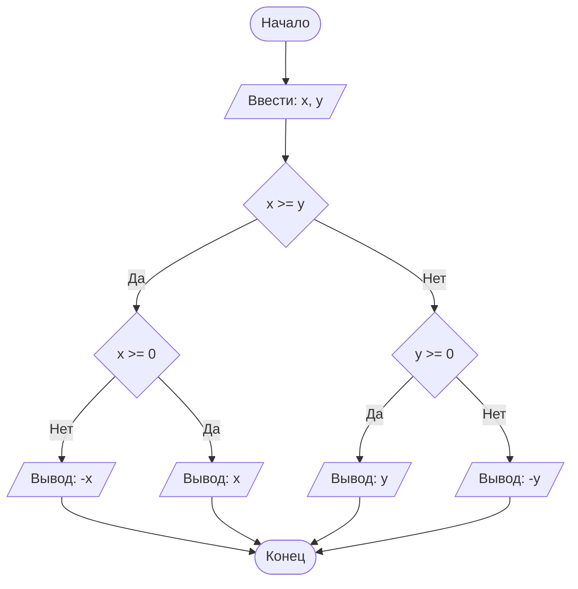

## Отчет по лабораторной работе № 1

#### № группы: `ПМ-2601`

#### Выполнил: `Мишарин Владислав Станиславович`

#### Вариант: `14`

### Cодержание:

- [Постановка задачи](#1-постановка-задачи)
- [Входные и выходные данные](#2-входные-и-выходные-данные)
- [Выбор структуры данных](#3-выбор-структуры-данных)
- [Алгоритм](#4-алгоритм)
- [Программа](#5-программа)
- [Анализ правильности решения](#6-анализ-правильности-решения)

### 1. Постановка задачи

> Программа получает на вход 2 числа a и b, каждое в диапазоне от $$-1.79 \cdot 10^{308}$$ до $$1.79 \cdot 10^{308}$$.
> Требуется вывести решение нер-ва вида $$\frac{a}{x \cdot (b - x)} \ge 0$$

Требуется проанализировать, как изменяется решение нер-ва в зависимости от введенных параметров a и b

### 2. Входные и выходные данные

#### Данные на вход

На вход программа должна получать 2 числа, при этом в условии не сказано, какому множеству
принадлежат получаемые числа, поэтому будем считать их вещественными. Также даны верхняя и нижняя границы получаемых
чисел.

|             | Тип                | min значение    | max значение   |
|-------------|--------------------|-----------------|----------------|
| X (Число 1) | Вещественное число | $$-1.79 \cdot 10^{308}$$  | $$1.79 \cdot 10^{308}$$ |
| Y (Число 2) | Вещественное число | $$-1.79 \cdot 10^{308}$$ | $$1.79 \cdot 10^{308}$$ |

#### Данные на выход

Решением нер-ва является множество/отрезок/интервал (или их объединение)

|         | Тип                                |
|---------|------------------------------------|
| Решение | Строка (String) |

### 3. Выбор структуры данных

Программа получает 2 вещественных числа, не превышающих по модулю 10<sup>9</sup> < 2<sup>30</sup>. Поэтому для их хранения
можно выделить 2 переменных (`x` и `y`) типа `double`.

|             | название переменной | Тип (в Java) | 
|-------------|---------------------|--------------|
| X (Число 1) | `x`                 | `double`     |
| Y (Число 2) | `y`                 | `double`     | 

Для вывода результата необязательно его хранить в отдельной переменной.

### 4. Алгоритм

#### Алгоритм выполнения программы:

1. **Ввод данных:**  
   Программа считывает два вещественных числа, обозначенные как `x` и `y`.

2. **Сравнение чисел:**  
   Программа сравнивает значения `x` и `y`. Если `x` больше или равно `y`, программа переходит к следующему шагу для
   работы с `x`. Если `y` больше, программа выполняет действия для работы с `y`.

3. **Проверка знака для выбранного числа:**
    - Если было выбрано число `x` (так как оно больше или равно `y`), проверяется, положительное оно или отрицательное.
      Если `x` положительное, оно выводится на экран. Если отрицательное, выводится его модуль (т.е. противоположное
      по знаку значение).
    - Если было выбрано число `y` (поскольку оно больше `x`), выполняется аналогичная проверка. Если `y` положительное,
      оно выводится на экран. Если отрицательное, выводится его модуль.

4. **Вывод результата:**  
   На экран выводится либо большее из чисел, либо его модуль, если это число отрицательное.

#### Блок-схема



### 5. Программа

```java
import java.util.Scanner;
import java.io.PrintStream;

public class Main {
    // Объявляем объект класса PrintStream для вывода данных
    public static PrintStream out = System.out;
    // Объявляем объект класса Scanner для ввода данных
    public static Scanner in = new Scanner(System.in);

    public static void main(String[] args) {
        // Считываем 2 вещественных числа с консоли - параметры a и b
        double a = in.nextDouble(), b = in.nextDouble();

        // Особые случаи: a = 0 или b = 0
        if (b==0) {
            // При b = 0 нер-во принимает вид - (a/-x^2)>=0
            if (a>0)
                // Поскольку -x^2<=0 при любых x, тогда при a>0 выражение
                // строго меньше 0 при любых x
                out.print("No such x");
            else
                // Иначе нер-во выполняется при любых x, кроме случая -x^2 = 0, следовательно x!=0
                out.print("x<0 or x>0");
        }
        else if (a==0) {
            // При a = 0 нер-во выполняется всегда, кроме случаев, когда x = 0 или x = b
            if (b>0)
                out.printf("x<0 or 0<x<%s or x>%s",b,b);
            else
                out.printf("x<%s or %s<x<0 or x>0",b,b);
        }
        // Если a!=0 и b!=0
        else {
            if (a>0) {
                // Исходное нер-во сводится к нер-ву вида x(b-x)>0
                if (b>0)
                    out.printf("0<x<%s",b);
                else
                    out.printf("%s<x<0",b);
            }
            else {
                // Исходное нер-во сводится к нер-ву вида x(b-x)<0
                if (b>0)
                    out.printf("x<0 or x>%s",b);
                else
                    out.printf("x<%s or x>0",b);
            }
        }
    }
}
```
