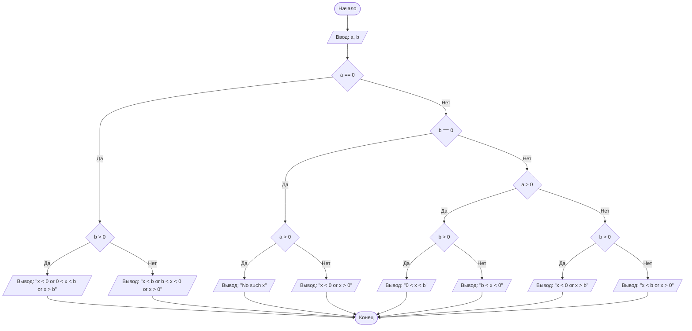

## Отчет по лабораторной работе № 1

#### № группы: `ПМ-2601`

#### Выполнил: `Мишарин Владислав Станиславович`

#### Вариант: `14`

### Cодержание:

- [Постановка задачи](#1-постановка-задачи)
- [Входные и выходные данные](#2-входные-и-выходные-данные)
- [Математическая модель](#3-математическая-модель)
- [Выбор структуры данных](#4-выбор-структуры-данных)
- [Алгоритм](#5-алгоритм)
- [Программа](#6-программа)
- [Анализ правильности решения](#7-анализ-правильности-решения)

### 1. Постановка задачи

> Программа получает на вход 2 числа a и b.
> Требуется вывести решение нер-ва вида $$\frac{a}{x \cdot (b - x)} \ge 0$$

Перед написанием программы требуется проанализировать, как изменяется решение нер-ва в зависимости от введенных параметров a и b:

Следовательно, программа должна сравнивать с нулем каждый из параметров a и b (т.е мы разбиваем нер-во на случаи (a>0 b<0, a=0 b>0 и т.д)) и вывести соответствующий данному случаю диапазон значений x или сообщение об отсутствии решений.

Всего существует `3*3=9` случаев для параметров a и b (по 3 для каждого параметра).

### 2. Входные и выходные данные

#### Данные на вход

На вход программа должна получать 2 числа, при этом в условии не сказано, какому множеству
принадлежат получаемые числа, поэтому будем считать их вещественными. Верхняя и нижняя границы получаемых
чисел не даны, поэтому ограничением будем считать макс. допустимое значение (по модулю) типа переменной `double` - $$1.79 \cdot 10^{308}$$.

|             | Тип                | min значение    | max значение   |
|-------------|--------------------|-----------------|----------------|
| a (Число 1) | Вещественное число | $$-1.79 \cdot 10^{308}$$  | $$1.79 \cdot 10^{308}$$ |
| b (Число 2) | Вещественное число | $$-1.79 \cdot 10^{308}$$ | $$1.79 \cdot 10^{308}$$ |

#### Данные на выход

Решением данного нер-ва является множество/интервал (или их объединение).
Поэтому ответ следует выводить в виде строки, поскольку нам необходимо использование символов сравнения (>, <), а также строковой записи "x" или "No such x" (в случае, когда нер-во не имеет решений).

|         | Тип                                |
|---------|------------------------------------|
| Решение | Строка  |

### 3. Математическая модель

**Область определения нер-ва:** $$x \neq 0$$ и $$x \neq b$$

**Случай 1** `a = 0`:
- Подслучай 1.1 - b>0: тогда решение - `x<0 or 0<x<b or x>b`
- Подслучай 1.2 - b<=0: тогда решение - `x<b or b<x<0 or x>0`
  
**Случай 2** `a ≠ 0; b = 0`:
- Подслучай 2.1 - a>0: тогда решений нет
- Подслучай 2.2 - a<0: тогда решение - `x<0 or x>0`

**Случай 3** `a > 0; b ≠ 0`:
- Подслучай 3.1 - b>0: тогда решение - `0<x<b`
- Подслучай 3.2 - b<0: тогда решение - `b<x<0`

**Случай 4** `a < 0; b ≠ 0`:
- Подслучай 4.1 - b>0: тогда решение - `x<0 or x>b`
- Подслучай 4.2 - b<0: тогда решение - `x<b or x>0`

### 4. Выбор структуры данных

Программа получает 2 вещественных числа. Поэтому для их хранения
можно выделить 2 переменных (`a` и `b`) типа `double`.

|             | название переменной | Тип (в Java) | 
|-------------|---------------------|--------------|
| Число 1 (параметр a) | `a`                 | `double`     |
| Число 2 (параметр b) | `b`                 | `double`     | 

Для вывода результата необязательно его хранить в отдельной переменной. Сам результат выводится на экран в формате строки (String).

### 5. Алгоритм

#### Алгоритм выполнения программы:

1. **Ввод данных:**  
   Программа считывает два вещественных числа, обозначенные как `a` и `b`.

2. **Сравнение чисел с нулем:**  
   Программа сравнивает значения `a` и `b` относительно нуля:
    
    2.1. **На равенство нулю**:
   - Если `a` равно нулю, то проверяем, больше ли нуля `b`. Если `b` больше, то рез-ом является строка `x<0 or 0<x<b or x>b`, иначе `x<b or b<x<0 or x>0`.
   - Если `a` не равно нулю, проверяем `b`: если `b` равно нулю, то проверяем, больше ли нуля `a`. Если `a` больше, то рез-ом является строка `No such x`, иначе `x<0 or x>0`.
    
    2.2. **Если ни один из параметров не равен нулю, то проверяем их на знак (больше или меньше нуля)**:
   - Если `a` положительное: если `b` положительное, то рез-ом является строка `0<x<b`, иначе - `b<x<0`.
   - Если `a` отрицательное: если `b` положительное, то рез-ом является строка `x<0 or x>b`, иначе - `x<b or x>0`.


3. **Вывод результата:**  
   На экран выводится результат - строка, являющаяся записью отрезка/интервала/множества (или их объединения).

В худшем случае код сделает 4 проверки.

#### Блок-схема



### 6. Программа

```java
import java.util.Scanner;
import java.io.PrintStream;

public class Main {
    // Объявляем объект класса PrintStream для вывода данных
    public static PrintStream out = System.out;
    // Объявляем объект класса Scanner для ввода данных
    public static Scanner in = new Scanner(System.in);

    public static void main(String[] args) {
        // Считываем 2 вещественных числа с консоли - параметры a и b
        double a = in.nextDouble(), b = in.nextDouble();

        // Особые случаи: a = 0 или b = 0
        if (a==0) {
            // При a = 0 нер-во выполняется всегда, кроме случаев, когда x = 0 или x = b
            if (b>0)
                out.printf("x<0 or 0<x<%s or x>%s",b,b);
            else
                out.printf("x<%s or %s<x<0 or x>0",b,b);
        }
        else if (b==0) {
            // При b = 0 нер-во принимает вид - (a/-x^2)>=0
            if (a>0)
                // Поскольку -x^2<=0 при любых x, тогда при a>0 выражение
                // строго меньше 0 при любых x
                out.print("No such x");
            else
                // Иначе нер-во выполняется при любых x, кроме случая -x^2 = 0, следовательно x!=0
                out.print("x<0 or x>0");
        }
        // Если a!=0 и b!=0
        else {
            if (a>0) {
                // Исходное нер-во сводится к нер-ву вида x(b-x)>0
                if (b>0)
                    out.printf("0<x<%s",b);
                else
                    out.printf("%s<x<0",b);
            }
            else {
                // Исходное нер-во сводится к нер-ву вида x(b-x)<0
                if (b>0)
                    out.printf("x<0 or x>%s",b);
                else
                    out.printf("x<%s or x>0",b);
            }
        }
    }
}
```

### 7. Анализ правильности решения

Программа работает корректно на всем множестве решений с учетом ограничений.

1. Тест на `a > 0, b = 0`:

    - **Input**:
        ```
        1 0
        ```

    - **Output**:
        ```
        "No such x"
        ```

2. Тест на `a < 0, b = 0`:

    - **Input**:
        ```
        -3 0
        ```

    - **Output**:
        ```
        "x<0 or x>0"
        ```

3. Тест на `a = 0, b > 0`:

    - **Input**:
        ```
        0 5
        ```

    - **Output**:
        ```
        "x<0 or 0<x<5.0 or x>5.0"
        ```

4. Тест на `a = 0, b < 0`:

    - **Input**:
        ```
        0 -4
        ```

    - **Output**:
        ```
        "x<-4.0 or -4.0<x<0 or x>0"
        ```

5. Тест на `a > 0, b > 0`:

    - **Input**:
        ```
        7 6
        ```

    - **Output**:
        ```
        "0<x<6.0"
        ```
6. Тест на `a > 0, b < 0`:

    - **Input**:
        ```
        7 -6
        ```

    - **Output**:
        ```
        "-6.0<x<0"
        ```
7. Тест на `a < 0, b > 0`:

    - **Input**:
        ```
        -9 3
        ```

    - **Output**:
        ```
        "x<0 or x>3.0"
        ```
8. Тест на `a < 0, b < 0`:

    - **Input**:
        ```
        -9 -3
        ```

    - **Output**:
        ```
        "x<-3.0 or x>0"
        ```
9. Тест на ограничение задачи:
    - **Input**:
        ```
        1.79E308 -1.79E308
        ```

    - **Output**:
        ```
        -1.79E308<x<0
        ```
```
